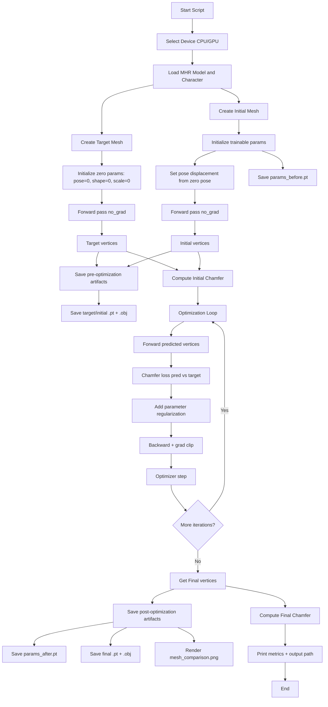

# MHR Optimization Pipeline Flow

This document summarizes the complete flow implemented in `example_optimization.py`.

## High-Level Goal

Optimize a trainable mesh (initialized with angular pose displacement) to match a zero-pose target mesh using a Torch Chamfer-distance objective.

## End-to-End Flowchart

## Core Stages

1. **Model Initialization**
   - Load `MHR` from assets.
   - Access `character_torch` for skinning + mesh topology (`faces`).

2. **Target Mesh Construction**
   - Build `DifferentiableMHRParameters` with all-zero pose/shape/scale.
   - Run forward pass to get target vertices.

3. **Initial Mesh Construction**
   - Build trainable parameters.
   - Apply angular displacement to pose from zero-pose baseline.
   - Run forward pass to get initial vertices.

4. **Optimization**
   - Loss = Torch Chamfer distance + small L2 regularization on trainable params.
   - Optimize with independent learning rates per parameter group.
   - Use gradient clipping for stability.

5. **Outputs**
   - Save before/after params: `params_before.pt`, `params_after.pt`.
   - Save meshes as tensors and OBJ: target/initial/final.
   - Save one visual summary image: `mesh_comparison.png`.
   - Print initial/final Chamfer for quick quality check.

## Files Produced

All outputs are written to:

- `outputs/mhr_optimization/`

Typical artifacts:

- `params_before.pt`
- `params_after.pt`
- `target_vertices.pt`, `initial_vertices.pt`, `final_vertices.pt`
- `target_mesh.obj`, `initial_mesh.obj`, `final_mesh.obj`
- `mesh_comparison.png`
